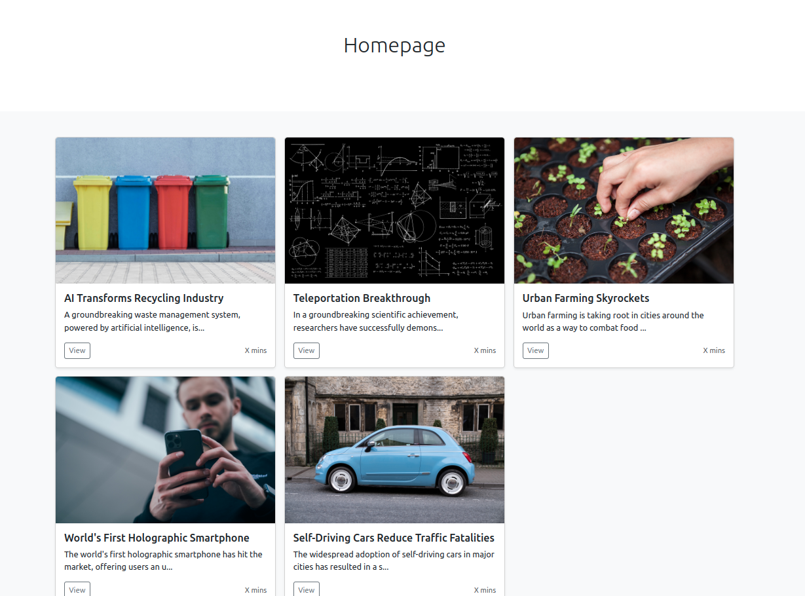

# Internship Take Home Test 

Our NFQ team would like to congratulate you on taking on this homework task, we're delighted to see your enthusiasm for the challenge ahead!

Here you'll find everything that's necessary to complete take home test, but first - let's take a look what's the aim and what we expect from you.
We prepared this test to prove your skills & also to show you the type of projects & tasks we work on day-to-day. 

We use modern PHP frameworks, libraries and tools. We use OOP, write automatic tests & care about code quality.  

We won't ask you to create a project from scratch, instead, we'll ask you to implement additional features to already existing ones.
This project that we built is a simple blog-like Symfony application. Users of the system can see a listing of all articles & view them.

What we expect:
1. [Install](#installation) the application. We provide two ways to install the application: [via Docker](#installation) or [natively](#native-installation). We recommend to use the docker installation for its easier setup.  
2. Do the given [Tasks](#tasks) 
3. [Submit your work](#submission)

At this time you don't need to know Symfony, but we expect you will be able to learn any gaps in knowledge.

If you want to learn more about Symfony, here's some helpful resources:
* Read the documentation: https://symfony.com/doc
* Alternatively, you can watch the official video tutorials: https://symfonycasts.com/
* Alternatively, you can read the official book: https://symfony.com/book

Best of luck!

## Installation

> We assume that you use a UNIX-like operating system like Linux (Ubuntu, i.e.), MacOS, or Windows with WSL
> 
> Syntax `command arguments` (for example, `composer install`)  shows CLI commands. Run them in the terminal. 

### Docker Installation 

Requirements:
* [Docker](https://docs.docker.com/engine/install/) 
* [Docker Compose](https://docs.docker.com/compose/): if you have a current version of Docker, Docker Compose is installed automatically

Setup:
1. In current folder (where docker-compose.yml file resides) run `docker compose up` (`docker-compose up` for older Docker versions)

2. When the containers are up, open a new terminal window. 

> It's also possible to run docker compose in detached mode: `docker compose up -d`. In this case, you can run all commands in the same terminal window.

3. Start a bash process in the php container by running `docker exec -it php bash`
4. Execute the installation script `bash init.sh` OR run commands individually:
   1. Install dependencies: `composer install`
   2. Create local SQLite database: `bin/console doctrine:database:create`
   3. Run database migrations: `bin/console doctrine:migrations:migrate`
   4. Load data: `bin/console doctrine:fixtures:load`
5. The application should now be available at http://127.0.0.1:8000

## Native Installation

Requirements:
* [PHP 8.1](https://www.php.net/)
* [Composer](https://getcomposer.org/)
* [SQLite](https://sqlite.org/index.html)
  * Note: You may need to install the `php-sqlite3` PHP extension 
* Optionally, Install Symfony CLI: https://symfony.com/download#step-1-install-symfony-cli
* Check other requirements: https://symfony.com/doc/current/setup.html

Setup: 
1. From the root directory (where this file `README.md` is located) navigate to the application source directory: `cd code/` 
2. Execute the installation script `bash init.sh` OR run commands individually:
   1. Install dependencies: `composer install`
   2. Create local SQLite database: `bin/console doctrine:database:create`
   3. Run database migrations: `bin/console doctrine:migrations:migrate`
   4. Load data: `bin/console doctrine:fixtures:load`
3. Run web server:
   * With PHP local server: `php -S localhost:8000 -t public/`
   * Or with Symfony CLI: `symfony serve`
4. The application should now be available at http://127.0.0.1:8000

### Final Remarks

After the installation you should see the Homepage with preset data:

## Tasks

1. Add a new Article entry so the Listing Page has 6 Articles
   
   Details:
   * Update Data Fixtures
   * You can use [article.txt](documentation/assets/article.txt) for inspiration

   Documentation: 
   * https://symfony.com/bundles/DoctrineFixturesBundle/current/index.html

2. Implement "Edit" functionality for an Article.

   Details:
   * Implement a new Edit Page with a new route
   * Implement a new Symfony Form for the Article
   * The user should be able to change the title, text & image of an Article 
   * Editing results are persisted in the database
   * Add a new "Edit" button in the Listing Page
   
   Documentation:
   * https://symfony.com/doc/current/page_creation.html
   * https://symfony.com/doc/current/doctrine.html
   * https://symfony.com/doc/current/forms.html

   Optional Requirements:
   * Add a new datetime "updated at" field that automatically updates after every edit
   * Sort articles in the listing page based on the "updated at" field: newly updated articles should be first  

3. Implement "X" minutes to read functionality. 
   
    Details:
    * Implement an algorithm to find how long any given text will be read in minutes:
      1. Count all words in a text that have more than 3 letters.
      2. Divide it by the 200 (the average readers' words per minute)
      3. Round up the number to get a nice value. 
    * Change all occurrences of "X min" in the Application to the actual value. 

   Optional Requirements:
   * Write a Unit Test for the Algorithm

## Submission
1. Use `git` to save your changes.
2. Make the code available in a public repository (Github, Bitbucket, etc.)
3. Send the repository URL to Ugnė Rumšaitė <ugne.rumsaite@nfq.lt>
